# Function Space Transfer of Probability Distributions

This work explores Bayesian models with priors defined in function space rather than weight space. Recent methods ([FVI](https://arxiv.org/abs/1903.05779), [FSVGD](https://arxiv.org/abs/1902.09754)) enable this by defining variational objectives directly over distributions on functions. Here, we construct such functional priors from the data-generating process itself (*e.g.* a physics simulator), inducing a stochastic process concentrated on functions matching known behaviour. This regularises learning directly in function space, transferring task structure (smoothness, invariances, characteristic scales) into the posterior. The approach targets better calibration, more reliable extrapolation, and improved data efficiency compared to standard weight-space priors ([VI](https://arxiv.org/abs/1505.05424), [SVGD](https://arxiv.org/abs/1608.04471)).

> Work done as part of my master's thesis at the [Learning and Adaptive Systems (LAS) Group](https://las.inf.ethz.ch/) at ETH Zurich. Supervisors: [Jonas Rothfuss](https://scholar.google.com/citations?user=EfLpX8QAAAAJ), [Andreas Krause](https://scholar.google.com/citations?user=eDHv58AAAAAJ). Full report: [`report.pdf`](report.pdf)

## Quick Start

Install dependencies with [uv](https://docs.astral.sh/uv/).

```bash
uv sync
```

## CLI

Run `uv run fpbnn -h` to see all options.

### Training

```bash
# Train specific model-environment combination
uv run fpbnn --model=fvi --env=hopper

# Train all models on an environment
uv run fpbnn --env=hopper

# Train multiple combinations
uv run fpbnn --model=fvi,svgd --env=densities,swimmer
```

- `--model`, `--env`: keys (comma-separated allowed).
- Training: `--n-iter`, `--batch-size`, `--learning-rate`, `--n-particles`.
- Data sizes: `--train-size`, `--test-size`.
- Reproducibility: `--seed`.
- Logging/plots: `--no-plot`, `--no-gif`, `--no-logging`, `--verbose`, `--verbose-ray`.
- SSGE (functional methods): `--ssge-bandwidth`, `--ssge-n-eigen`, `--coeff-entropy`.

### Tuning

```bash
uv run fpbnn --tune --model=fvi --env=hopper --num-samples=20
```

Best configs are saved under `configs/<env>/<model>.yaml`.

## Models & Environments

- Models: `mlp`, `vi`, `svgd`, `fvi`, `fsvgd`.
- Environments: `sinusoids`, `densities`, `inverted_pendulum`, `swimmer`, `inverted_double_pendulum`, `reacher`, `hopper`, `half_cheetah`, `ant`.

| Environment                       | MLP                                                  | VI                                                 | SVGD                                                   | FVI                                                  | FSVGD                                                    |
| --------------------------------- | ---------------------------------------------------- | -------------------------------------------------- | ------------------------------------------------------ | ---------------------------------------------------- | -------------------------------------------------------- |
| **Sinusoids (1D)**                | 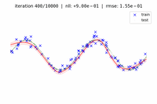                | 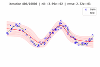                | 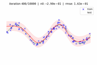                | 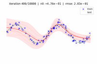                | 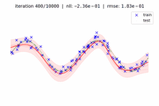                |
| **Densities (1D)**                | 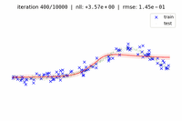                | 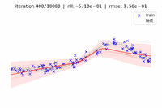                | 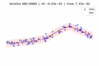                | 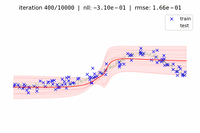                | 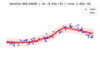                |
| **Inverted Pendulum (4D)**        | 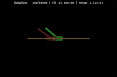        | 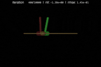        | 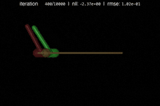        | 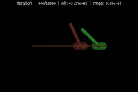        | 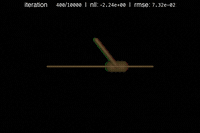        |
| **Swimmer (8D)**                  | 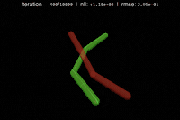                  | 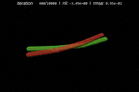                  | 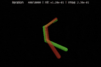                  | 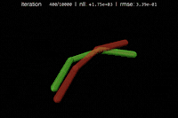                  | 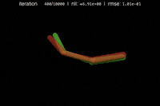                  |
| **Inverted Double Pendulum (9D)** | 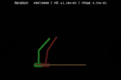 | 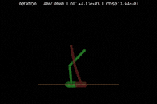 | 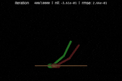 | 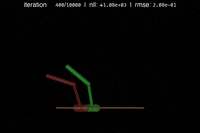 | 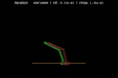 |
| **Reacher (10D)**                 | 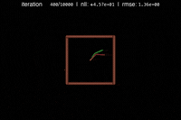                  | 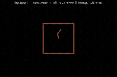                  | 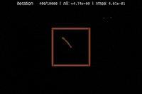                  | 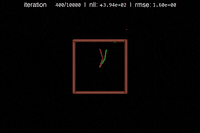                  | 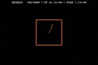                  |
| **Hopper (11D)**                  | 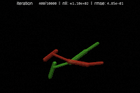                   | 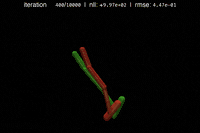                   | 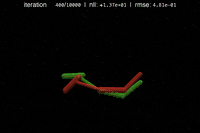                   | 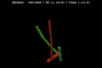                   | 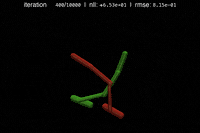                   |
| **Half Cheetah (17D)**            | 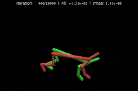             | 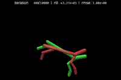             | 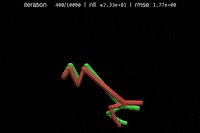             | 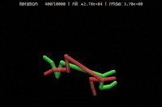             | 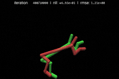             |
| **Ant (105D)**                    | 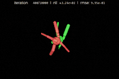                      | 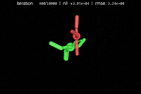                      | 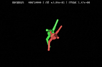                      | 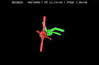                      | 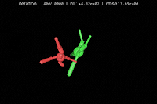                      |

### Environment Details

- **Toy Problems**: Curve fitting with calibrated uncertainty.
- **Control Tasks**: Forward dynamics ($s_{t+1} | s_t, a_t$) learning from MuJoCo simulations.

## Consolidated modules

See [Consolidated projects](CONSOLIDATION.md) for the source projects, run commands and retained history. List commands with `uv run --no-project workspace.py --list`.
